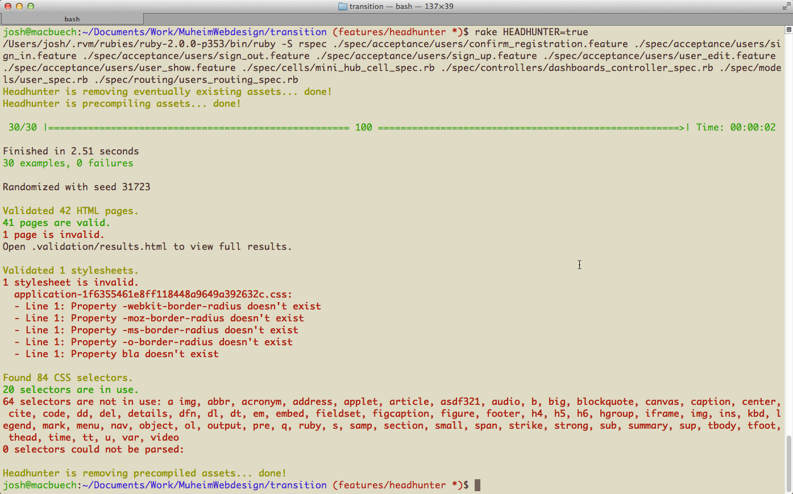

# Headhunter


[](http://badge.fury.io/rb/headhunter)
[](https://codeclimate.com/github/jmuheim/headhunter)
[](https://travis-ci.org/jmuheim/headhunter)
[](https://bitdeli.com/free "Bitdeli Badge")
[](https://gemnasium.com/jmuheim/headhunter)
[](https://coveralls.io/r/jmuheim/headhunter)

Headhunter is an HTML and CSS validation tool that injects itself into your Rails feature tests and auto<strong>magic</strong>ally checks all your generated HTML and CSS for validity.

In addition, it also looks out for unused (and therefore superfluous) CSS selectors.

This is all done **locally**, so no external service is used.

## How to use

Add Headhunter to your `Gemfile`:

```ruby
group :test do
  gem 'headhunter'
end
```

Just set the environment variable `HEADHUNTER` to `true` when running your tests, e.g.:

```
$ rake HEADHUNTER=true
$ HEADHUNTER=true rspec
$ HEADHUNTER=true cucumber
```

Headhunter doesn't keep your tests from passing if invalid HTML or unused CSS is found. Instead it displays a short statistic after the tests are run.



## How it works

Headhunter registers itself as middleware in the Rack stack and triggers validation for every HTML response. Headhunter also iterates over every `.css` file and triggers its validation. In addition, it checks which CSS selectors are really used in the HTML pages to see whether there exist any unused CSS definitions.

For being able to validate CSS, `rake assets:precompile` is triggered at the beginning of running tests. This may slow down starting your tests a bit. **Notice: all precompiled assets will be removed after the tests have finished!**

**Please keep in mind that this is a pretty early release. I didn't have the possibility to test it extensively yet, so there surely are a lot of things left to do. You are highly welcome to file issues, add feature requests and open pull requests.**

## Requirements

A local copy of **[Tidy HTML](http://tidy.sourceforge.net/)** is used. It's the [experimental HTML5 version]((http://techblog.willshouse.com/2013/10/21/homebrew-tidy-html5/), compiled on OSX using [homebrew](http://brew.sh/). If you're on Linux and it doesn't work for you, please replace the executable in `lib/tidy`.

You need a **Java Runtime Environment** to run CSS validation. This should normally already be available on OSX and Linux machines, too. A local copy ([`css-validator.jar`](http://jigsaw.w3.org/css-validator/DOWNLOAD.html)) of the [W3 CSS Validation Service](http://jigsaw.w3.org/css-validator/) is used.

## Known issues and future plans

- **Test on Linux! Add switch to use linux-compiled version of tidy if needed.**
- It would be nice to use Rails' own assets compilation that's executed when the first JavaScript test is run. Anyone has an idea on how to do this?
- HTML and CSS sources should not be uglified, to allow more concise error messages
- Would be really useful to have the concrete URL of every validated HTML page. But can't find a way to extract it from Rack response.
- Didn't try this with AJAX requests yet. Would be great if such responses would be validated, too!
- More configuration options needed! CSS1, CSS2, CSS2.1, CSS3! XHTML, HTML5, etc.
- Better output needed! With context lines, etc.
  - HTML output: info about GET/POST/PUT/DELETE!
- Look out for multiple used IDs on the same page and raise error (tidy doesn't seem to do this?!)!
- Look out for invalid tags and raise error (tidy doesn't seem to do this?!)!
- Cache HTML validations: use MD5 to prevent validating the same source again and again! (Maybe even keep the cache between running specs!)
- Add option to CssHunter that ignores "bare" rules like applet, blockquote, etc. (which usually stem from libraries like Compass reset or Normalize)
- Add option to specify known invalid/unused tags, attributes and selectors (e.g. `aria-*` or `ng-*`).
- Add option to ignore vendor prefixed attributes.
- Add option to make Headhunter automatically remove unused CSS selectors from compiled file

## Disclaimer

Headhunter is heavily inspired by Aanand Prasad's [Deadweight gem](https://github.com/aanand/deadweight), Eric Beland's [HTML Validation gem](https://github.com/ericbeland/html_validation) and Unboxed Consulting's [be\_valid\_asset gem](https://github.com/unboxed/be_valid_asset). Thank you for your pioneering work!

**USE THIS GEM AT YOUR OWN RISK!**

All provided functionality is provided "as is".


[](https://bitdeli.com/free "Bitdeli Badge")

